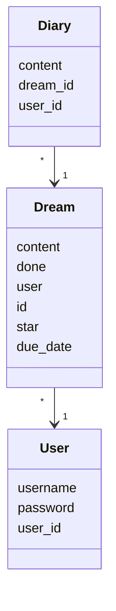
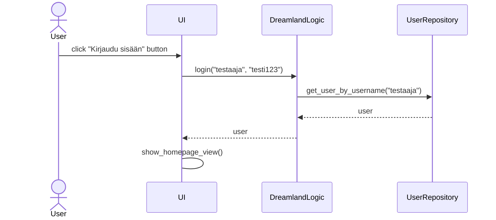
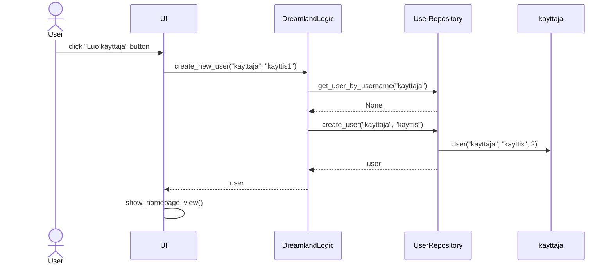
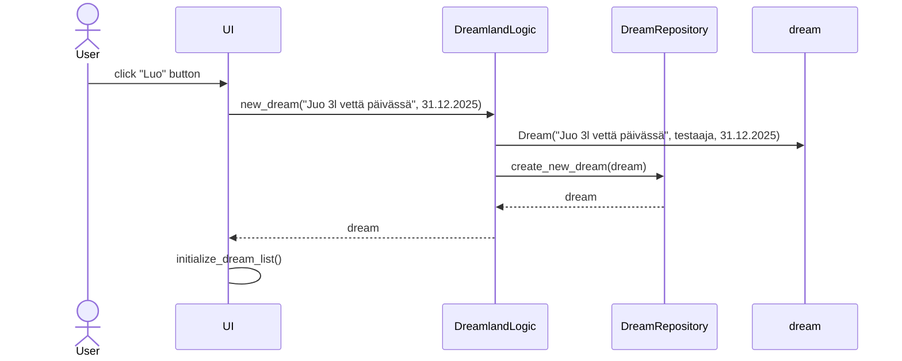

# Arkkitehtuurikuvaus
## Rakenne
Sovelluksen rakenne noudattaa kolmitasoista kerrosarkkitehtuuria. Alla olevassa kuvassa näkyy ohjelman pakkausrakenne:

__Ui__ pakkaus sisältää käyttöliittymän koodin, __logic__ pakkaus sisältää sovelluslogiikan koodin, __repositories__ pakkaus sisältää tietojen tallennukseen liittyvän koodin ja __entities__ pakkaus sisältää sovelluksen tarvitsemia tietoja kuvaavia luokkia.

## Käyttöliittymä
Käyttöliittymä on eristetty sovelluslogiikasta.
Käyttöliittymässä on neljä eri näkymää:
- Kirjautumissivu (login page)
- Rekisteröitymissivu (registration page)
- Kotisivu (homepage)
- Unelmasivu (dream page)

Sivujen näyttämisestä vastaa UI-luokka ja vain yksi sivu on näkyvissä kerrallaan.

## Sovelluslogiikka
Luokat __User__, __Dream__ ja __Diary__ kuvaavat käyttäjiä, heidän haaveitaan sekä haaveisiin liittyviä päiväkirjamerkintöjä, jotka muodostavat sovelluksen loogisen tietomallin.



Toiminnallisuudesta vastaa luokka __DreamlandLogic__, joka sisältää metodit kaikille käyttöliittymän toiminnoille. Pakkauksessa __repositories__ sijaitsee tietojen tallennuksesta vastaavat luokat __UserRepository__, __DreamRepository__ ja __DiaryRepository__, joiden kautta __DreamlandLogic__ pääsee käsiksi käyttäjiin ja haaveisiin ja päiväkirjamerkintöihin. Nämä __repositories__ pakkauksen luokat injektoidaan sovelluslogiikkaan konstruktorissa. 
Alla on kuva __DreamlandLogic__ luokan ja sovelluksen muiden osien suhdetta kuvaavasta luokka-/pakkauskaaviosta:


## Tietojen pysyväistallennus
Pakkauksen __repositories__ luokat vastaavat siis tietojen pysyväistallennuksesta. Luokka __DreamRepository__ tallentaa tiedot CSV-tiedostoon ja luokat __UserRepository__ ja __DiaryRepository__ tallentavat tiedot SQLite-tietokantaan. 

### Tiedostot
Sovellus tallentaa käytättäjien, haaveiden ja päiväkirjamerkintöjen tiedot erillisiin tiedostoihin, jotka on määritelty sovelluksen juuressa __.env__-tiedostossa.
Sovellus tallentaa haaveet CSV-tieodostoon seruaavalla tavalla:
```
1; Juo 3l vettä päivittäin; 0; testaaja; 1; 30.06.2025
2; Nuku vähintään 8h joka yö; 1; testaaja; 5; 31.12.2025
```
Eli tavoitteen/haaveen id, tavoite/haave, saavutettu (0 = ei, 1 = kyllä), käyttäjänimi, tähdet (1 = ei tärkeä, 5 = ykkös prioriteetti), aikaraja haaveen tavoittamiselle. Kenttien arvot erotetaan puolipisteellä ;

Sovellus tallentaa käyttäjät ja päiväkirjamerkinnät SQLite-tietokantatauluihin __users__ ja __diary__ , jotka alustetaan __initialize_database.py__-tiedostossa.

## Sovelluksen päätoiminnallisuudet
Alla kuvataan sovelluksen kannalta oleellisimpia toiminnallisuuksia sekvenssikaavioina:

### Sisäänkirjautuminen:
Kun kirjautumissivun kenttiin kirjoitetaan käyttäjänimi ja salasana, jonka jälkeen painetaan "Kirjaudu sisään" -nappia, etenee sovellus alla olevan kuvan tavalla:

Tapahtumakäsittelijä kutsuu sovelluslogiikan metodia __login__, antaen sille parametriksi käyttäjänimen ja salasanan. Sovelluslogiikka selvittää __UserRepository__:n avulla onnistuuko kirjautuminen. Kirjautuminen epäonnistuu jos käyttäjää ei ole olemassa tai tunnukset eivät täsmää olemassaolevaan käyttäjään. Kirjautumisen onnistuessa käyttöliittymä vaihtaa näkymäksi kotisivun, jossa näkyy kirjautuneen käyttäjän haaveet.

## Rekisteröityminen
Kun rekisteröitymissivun kenttiin kirjoitetaan uniikki ja 3-20 merkkiä pitkä käyttäjänimi sekä vähintään 5 merkkiä pitkä salasana, jonka jälkeen painetaan "Luo käyttäjä" -nappia, etenee sovellus alla olevan kuvan tavalla:

Tapahtumakäsittelijä kutsuu sovelluslogiikan metodia __create_new_user__, antaen sille parametriksi käyttäjänimen ja salasanan. Sovelluslogiikka selvittää __UserRepository__:n avulla, onko käyttäjänimi jo käytössä. Jos on, tulee siitä virheilmoitus. Kun käyttäjä on valinnut käyttäjänimen, joka ei ole vielä käytössä, sovelluslogiikka kutsuu __UserRepository__:n metodia __create_user__ antaen sille parametsiksi uudet käyttäjätunnukset, joka puolestaan luo uuden User-olion ja tallentaa sen tietokantaan. Onnistuneesta rekisteröitymisestä seuraa, että uusi käyttäjä kirjataan sisään ja näkymä vaihtuu kotisivuksi.
    
## Haaveen lisääminen
Kun kotisivun kenttään "Lisää tavoite" kirjoitetaan uusi tavoite/haave, sekä asetetaan tavoiteaika valitsemalla päivämäärä dropdown-valikossa aukeavasta kalenterista, sekä painetaan "Luo" -nappia, etenee sovellus alla olevan kuvan tavalla:

Tapahtumakäsittelijä kutsuu sovelluslogiikan metodia __new_dream__ antaen sille parametriksi haaveen sisällön ja tavoiteajan. Sovelluslogiikka luo uuden Dream-olion ja kutsuu __DreamRepository__:n metodia __create_new_dream__, jolloin haave tallentuu. Tämän jälkeen käyttöliittymän näkymä kotisivulla päivitetään kutsumalla sen omaa metodia __initialize_dream_list__, jolloin uusi haave/tavoite tulee kotisivulle näkyviin.
